# VRM Galgame 编辑器 · 公开版 0.0.13

[简体中文](README.md) · [English](docs/README.en.md) · [日本語](docs/README.ja.md) · [한국어](docs/README.ko.md)

把自己准备的角色、图片、声音和文字，做成可以玩的 Windows 故事游戏。当前公开版 **0.0.13** 修复描边导致天空球变黑，加入环境自动保存与实时 VRM 头像，改善暗场景人物光照。保留 GLB 场景动画、Mixamo 动作修复、物品绑定、逐句登场与多人标题。

**第一次使用？先看 [图文说明书](docs/新手说明书.md)。** 它从下载、准备素材到导出游戏一步一步讲清楚。

## 下载

到 [Releases 下载最新版](https://github.com/2396846264/-vrm-galgame-editor/releases/latest)，下载 `VRMGalgame-0.0.13-win-x64.zip`。把 ZIP **完整解压**，再双击文件夹里的 `VRMGalgame.exe`。适用于 Windows 10/11 x64，需要 Microsoft Edge WebView2 Runtime；下载包自带 .NET 运行环境。

> 公开包不附带示例人物、背景、Mixamo 动作或故事工程。下列图片是**示例与效果图**，展示做出来可以是什么样子；请使用自己有权使用的素材。

## 0.0.13 更新：天空描边与实时头像

天空球不再被描边涂黑；环境编辑器每 10 分钟自动保存，带倒计时与保存动画。人物跟随场景光照，VRM 左下角头像实时同步嘴型和表情。

**[打开完整图文说明](docs/天空描边与实时头像_v0.0.13.md)**

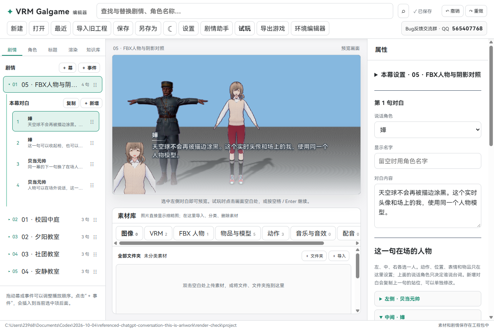

## 0.0.12 更新：GLB 场景动画

在每句对白中设置环境模型的动作、是否播放、延迟时间和声音。本幕没有带动画的 GLB 时自动隐藏按钮。支持试播、撤销、工程保存和独立游戏。

**[打开完整图文说明](docs/GLB场景动画_v0.0.12.md)**

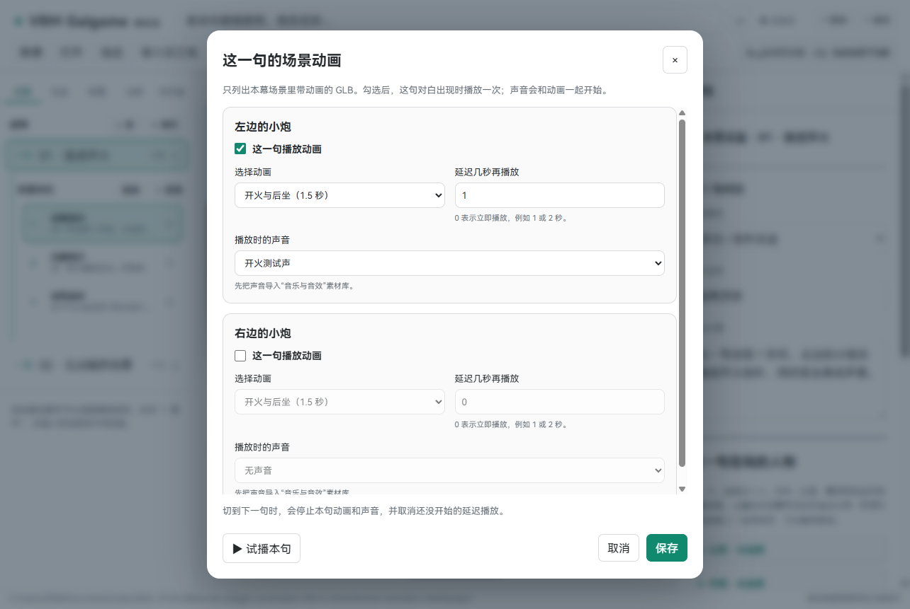

## 0.0.11 更新：Mixamo 动作修复

修复 FBX 导入瞄准动作后手臂跑偏，以及 FBX / VRM 跪姿、坐姿被抬高的问题。用真实动画数据和 Windows 实际画面核对，保留手掌、手指的物品绑定与已有工程设置。

**[打开完整图文说明](docs/Mixamo动作修复_v0.0.11.md)**

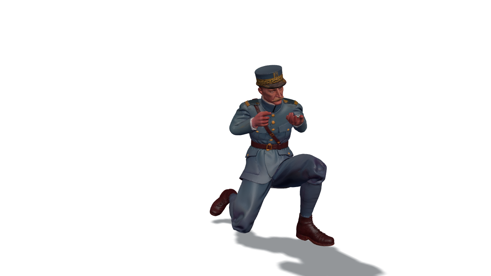

## 0.0.10 更新：物品绑定、逐句登场与多人标题

在角色页把 GLB 物品绑到手掌、手指或其他骨骼，使用粗调、细调和数字输入找准位置。绑定时可以转动、平移和拉近视角，直接放大手掌或手指。每句对白分别安排三个在场人物与物品显示；标题可放更多人物，并可完全隐藏左侧 Logo 标题板。

**[打开完整图文说明](docs/物品绑定与多人标题_v0.0.10.md)** · [本次更新记录](RELEASE_NOTES.md)

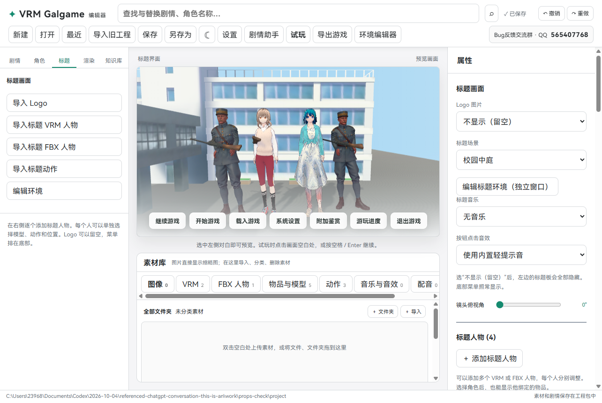

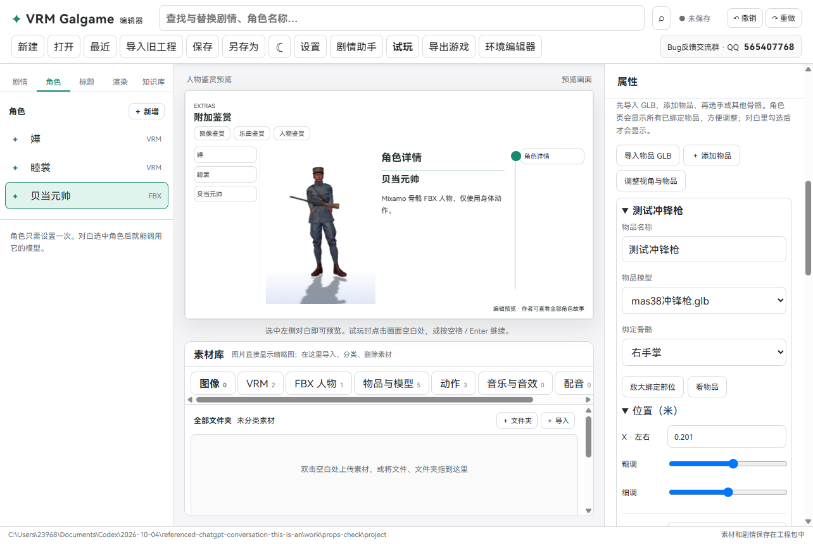

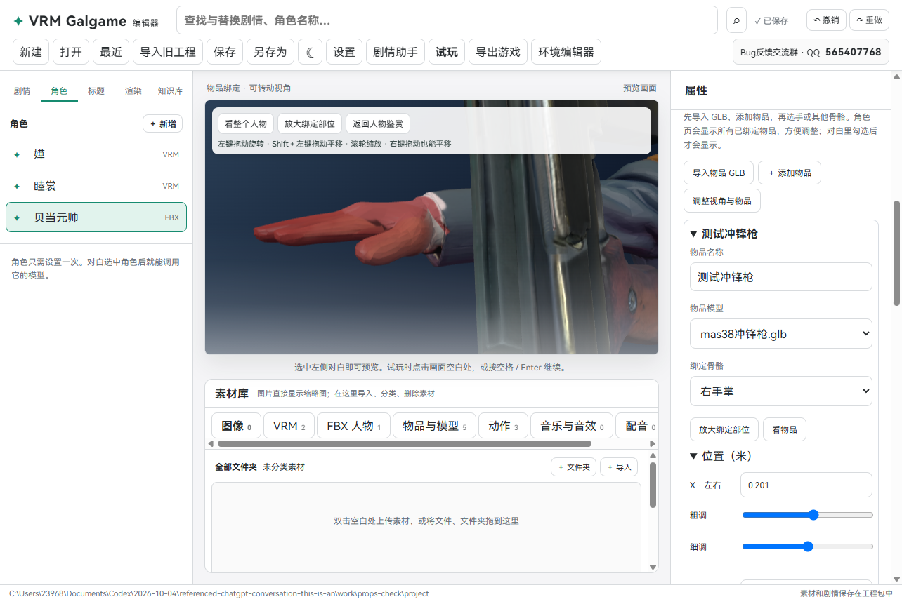

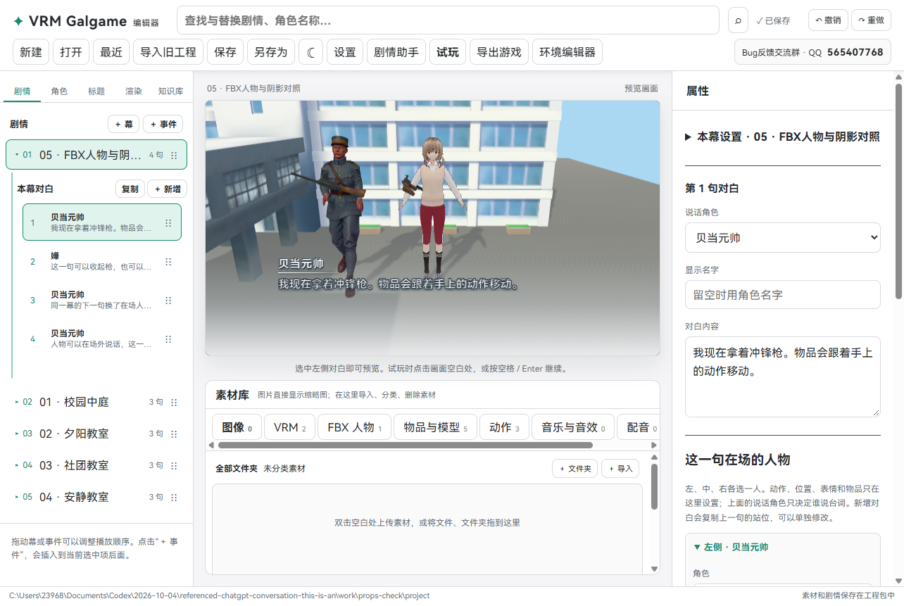

## 0.0.9 更新：3D 环境与 FBX 人物

独立环境编辑窗口、工程内多环境、GLB 和远景图片摆放、分组、地面和灯光、透明参考人物、游戏镜头保存、真实阴影，以及 Mixamo FBX 人物。前后位置可以直接输入数字，每次微调 0.01。

**[打开完整图文说明](docs/3D环境与FBX人物_v0.0.9.md)**

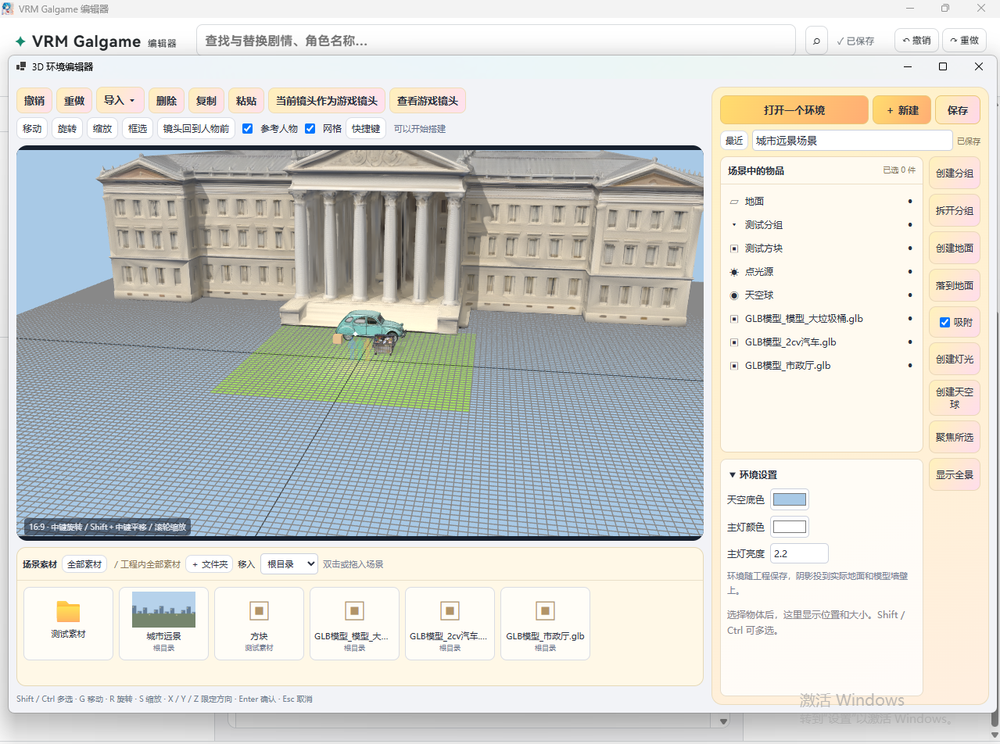

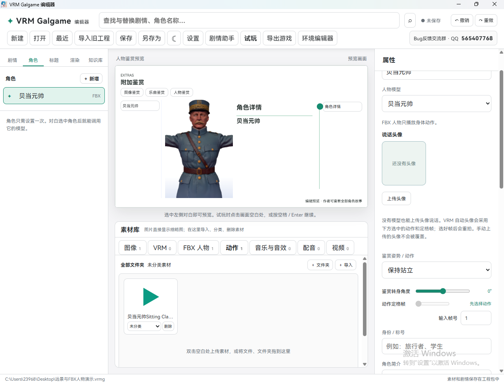

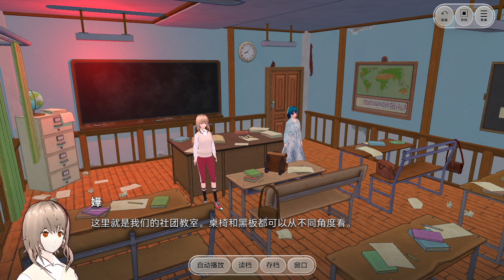

## 0.0.8 已有功能

- 顶部查找与替换，批量改对白、人物名字和介绍；游戏名称在“标题”页修改。
- PDF 知识库：大封面书库、完成指定幕后解锁、离线双页翻书阅读。
- 每幕独立封面、渲染和调色；封面卡片章节重玩。
- 乳白透明玻璃菜单、清晰黑字、透明按钮悬停变毛玻璃；无框对白增加黑色阴影。
- 自动头像覆盖旧图、设置可滚动、首次标题音乐和书本入口修复。
- 每幕天气、世界新闻事件、撤销重做、角色专属配音和自动说话嘴型。
- 剧情助手：导入小说或大纲，连接 MCP/CLI Agent，检查后批量生成角色、幕、对白、动作、音乐和天气粗稿。

详细步骤见 [本版图文说明](docs/新功能说明_v0.7.29.md) 和 [源码编译说明](docs/源码编译.md)。

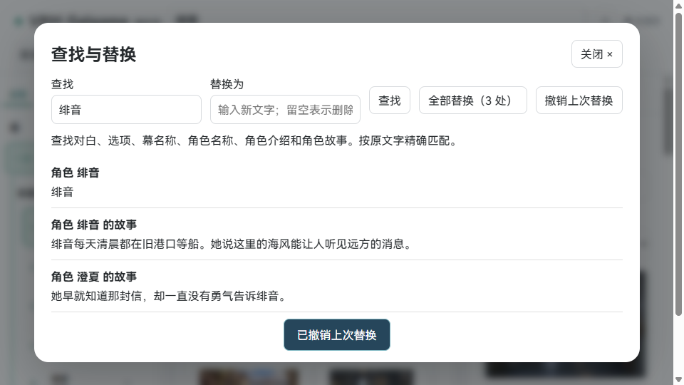


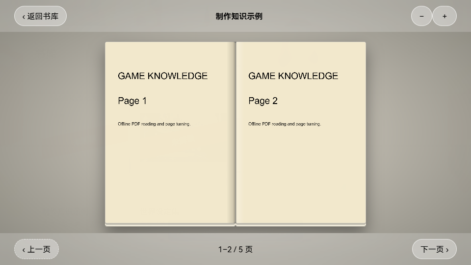

## 示例与效果图

**剧情编辑：**左边排故事，右边改细节，中间看画面。


**标题画面：**玩家打开游戏时看到的菜单。


**游玩画面：**角色、背景和对白放在一起。


**白色编辑器示例：**这张截图拍摄于上一版；最新版把“定格时间”改成了“定格帧”。


**最新版控件示意图：**阴影高度统一调节；动作可拖动滑块或输入帧号。


更多步骤和截图：[打开图文说明书](docs/新手说明书.md)。

## 这版增加了什么

- 素材库固定在预览画面下方，分为“图像、VRM、动作、声音、视频”五个标签；图片显示缩略图，其他素材显示类型图标。
- 文件夹可以点击进入，空白处双击可以导入；也可以把文件或文件夹拖入素材库，程序会按格式自动分类，拖入文件夹会自动建立同名分类文件夹。
- 左侧不再显示素材列表，素材统一在中间素材库管理；原来的分类、删除和鉴赏设置继续保留。
- 游戏中的按钮有点击声，可在标题画面选择自己的音效；每句对白也能配一个场景音效。玩家可在游戏设置里调节音效音量。
- 对白逐字出现，玩家可在游戏设置里调节出现速度。点一下先显示全句，再点一下才进入下一句。
- 用户提供的 64 个示例素材留在本地交付工程包中，公开版不包含这些素材。
- “渲染 → 角色阴影”增加统一的阴影水平高度滑块。脚底和影子隔开时可以抬高影子；旧工程保持原来的高度。
- 角色动作改为按“第几帧”定格，显示总帧数，还可以直接输入帧号。旧工程中的秒数会自动换算。
- 阴影从脚边开始；站着说话时可以固定脚掌，较大的动作也不会随意把人物带离站位。
- “渲染”里增加油画笔触，可同时处理人物和背景；不需要时可以关掉。
- 可以建立只有头像、没有 VRM 模型的角色。场外人物说话时只显示头像、名字和台词。
- 有 VRM 的角色可以自动拍透明的头肩头像；头像会跟随角色鉴赏选定的动作及**动作定格帧**更新，手动上传的头像不会被覆盖。
- 保留白色编辑器、夜间模式、人物加载转圈、内置 HarmonyOS Sans SC；游戏采用透明玻璃菜单与无框对白。

完整变化见 [更新记录](CHANGELOG.md)。

## 素材小抄

| 想放什么 | 允许的文件 |
| --- | --- |
| 3D 人物 | `.vrm`、Mixamo 骨骼人物 `.fbx` |
| 环境模型 | 贴图内嵌 `.glb` |
| 动作 | `.vrma`、Mixamo `.fbx` |
| 背景、头像等图片 | `.png`、`.jpg`、`.jpeg`、`.webp` |
| 音乐、音效 | `.mp3`、`.wav`、`.ogg` |
| 视频背景 | `.mp4`、`.webm` |
| 知识库书本 | `.pdf`（在知识库页导入） |
| 编辑器工程 | `.vrmg`（由编辑器创建和保存） |

推荐尺寸、命名方法、注意事项和常见问题都在 [图文说明书](docs/新手说明书.md)。

## 从源码构建

需要 Windows、Node.js、npm 和 .NET 10 SDK。在仓库根目录运行：

```powershell
./scripts/build-windows.ps1
```

保留 `publish` 中的 EXE、`WebView2Loader.dll` 和 `web` 文件夹。字体的授权文件见 [HarmonyOS Sans SC 授权](public/fonts/HarmonyOS_Sans_SC_LICENSE.txt)。第三方依赖遵循各自的许可；本仓库未对项目源码另附再授权许可。

作者 B 站：[尸工U5十三世的个人空间](https://b23.tv/krcyQ8I)
