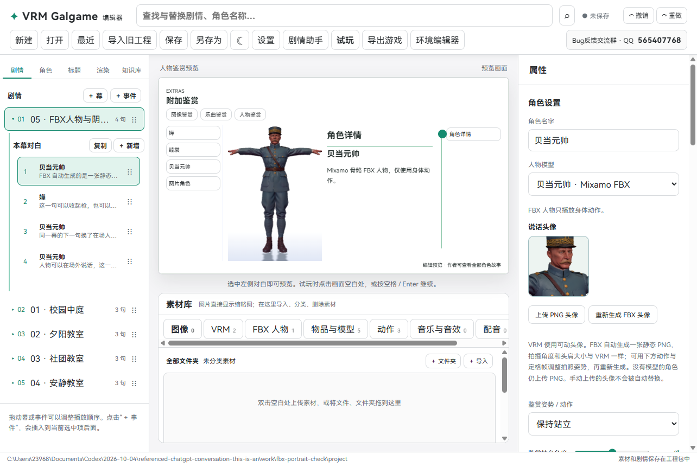
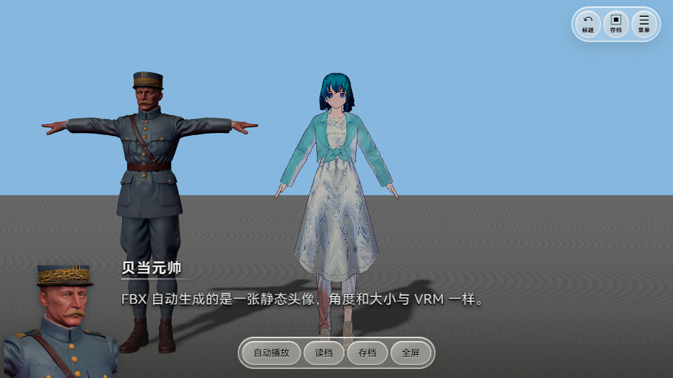

# 0.0.16 · FBX 自动生成静态头像

FBX 人物现在可以自动生成头像。头像是一张透明 PNG 图片，和 VRM 头像使用相同的拍摄方向、头肩范围和显示尺寸。它不会跟着人物动，也不会播放嘴型或表情。

## 怎么使用

1. 完整解压新版 ZIP，打开 `VRMGalgame.exe`。
2. 打开或新建工程，在“角色”页选择 FBX 人物模型。这个角色没有头像时，会自动生成一张 PNG。旧工程里缺少头像的 FBX 角色也会补上。
3. 在“说话头像”里查看照片。如果想重新拍，点击 **重新生成 FBX 头像**。
4. 想用其他姿势拍照，可以先选择“鉴赏姿势 / 动作”，再选定“动作定格帧”，最后点击重新生成。照片只保留选中的这一帧。
5. 保存工程。头像会一起放进工程包，导出的游戏也会使用这张图片。

## 在游戏里是什么效果

左下角显示一张静态图片。场上的 FBX 人物可以继续播放身体动作，头像不会跟着变化。VRM 原来的实时模型头像、嘴型和表情保持原样。

## 已有头像会不会被覆盖

已经手动上传的 PNG 会保留，自动生成不会覆盖它。如果你主动点击“重新生成 FBX 头像”，则用新照片替换当前头像。重复重新生成会更新原来的自动头像，不会在素材库堆出很多副本。纯图片角色继续上传自己的 PNG。

自动照片使用单独的拍摄灯光，等模型贴图加载完再拍照，不会改动场上人物、镜头或原始 FBX 文件。生成的头像放在隐藏的自动头像分类里，不占用普通图片素材列表。

## 更新旧工程

完整解压 0.0.16 后，用新版打开原工程即可。已经导出的游戏需要重新导出，才会带上新头像。截图中的人物仅用于实际功能测试，下载包不包含这些人物模型和故事工程。

## 已检查

使用用户提供的 Mixamo 骨骼“贝当元帅.fbx”实际检查：缺失头像自动生成、透明 PNG 512×512、与 VRM 共用肩部拍摄镜头、手动图片保护、主动重拍、重复重拍复用素材、工程压缩包重新打开、独立游戏静态显示。18 组源码检查、网页和 Windows 程序构建通过。
