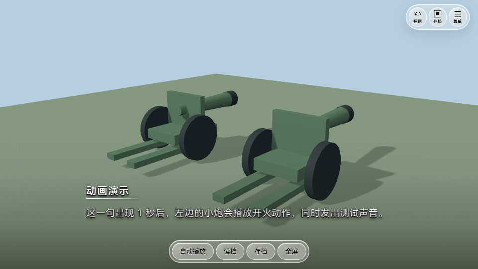

# 0.0.12 · GLB 场景动画

场景里的模型现在可以播放 GLB 自带的动作。例如，小炮可以后坐开火、门可以打开，机械可以转动。每一句对白分别决定哪些物体播放动画、延迟多久，以及播放什么声音。

## 在哪里设置

1. 在环境编辑器中导入**已经带动画的 GLB**，把它放入场景并保存。
2. 回到“剧情”，让本幕使用这个环境，选择一句对白。
3. 在右侧找到“本句音效”，下面会出现 **场景动画** 按钮。
4. 点击按钮，勾选“这一句播放动画”，选择动作。
5. 填写延迟时间：`0` 是立即播放，`1` 是等一秒，`2` 是等两秒，也能填 `0.5`。
6. 选择声音。声音先导入“音乐与音效”素材库，不需要声音就选“无声音”。
7. 点击“试播本句”查看动作和声音，满意后点“保存”。点“取消”会保留原来的设置。

如果本幕场景里没有带动画的 GLB，**按钮自动隐藏**。判断依据是模型文件中实际存在的动画；普通 GLB 不会因为文件后缀一样就显示按钮。

同一个 GLB 放两份，例如左边一门炮、右边一门炮，分别设置。一个物体本句可以选一个动作，不占用左、中、右人物位置。

## 播放规则

- 动画从本句出现时开始计算延迟，播放一次；本句结束前保留动画最后的姿势。
- 声音会提前加载，在动画开始时播放，使用游戏的音效音量。
- 没勾选的物体不播放；新的对白默认不添加动画设置。复制对白会复制动画设置。
- 切到下一句，会恢复模型的原始姿势，停止本句声音，并取消还没开始的延迟动作。
- 打开游戏菜单时，动作、延迟计时和声音一起暂停，关闭菜单后继续。
- 工程压缩包保存这些设置；导出的独立游戏也支持。

## 小炮示例

示例由程序创建的简单模型组成，包含两段动画：“开火与后坐”和“炮管左右转动”，配有短促的测试声音。

示例第一幕有三句对白：第一句左炮延迟一秒开火；第二句不播放；第三句右炮转动。第二幕只有静态 GLB，按钮隐藏。

**动画需要提前做在模型文件中。** 导入一门静态大炮不会自动产生开火动作。后坐、炮管移动等可以由 GLB 动画完成；烟雾、粒子爆炸和物理碰撞不在本次功能里。自带动画的模型按原骨骼播放，不需要冒充 Mixamo 人物。

## 验证结果

Windows 编辑器与独立游戏实际检查通过：动画读取、两份模型单独设置、延迟开火、真实音频播放、菜单暂停音频与模型、切句取消延迟、选择第二个动作、切换静态场景、撤销重做、复制对白、保存压缩包和重新打开。

12 组源码检查、网页构建和 Windows 程序构建通过。前一版 Mixamo 动作修复和物品绑定继续保留。
