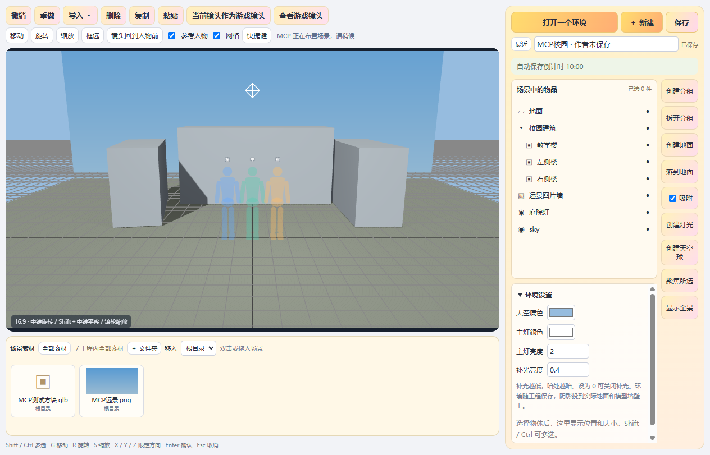
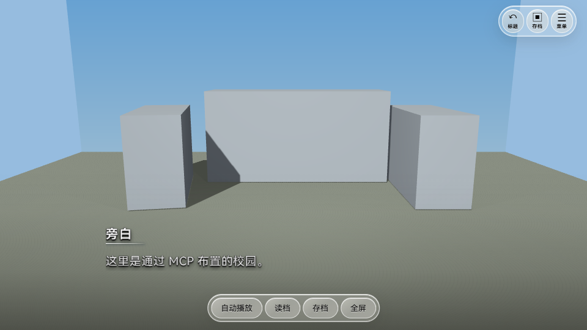

# 0.0.15 · 用聊天布置三维环境

MCP 现在可以帮你布置场景。告诉已经连接的 Agent：“把教学楼放在后面，左边放树，加一盏灯，镜头对着人物初始位置。”它就能读取工程里的素材、调整环境，并查看实际画面。

## 怎么使用

1. 完整解压新版 ZIP，打开里面的 `VRMGalgame.exe`，新建或打开工程。
2. 点击顶部“剧情助手”，在“连接 Agent”里开启本地接口，复制 MCP 配置到你使用的 Agent。旧配置如果指向旧版文件夹，要改成新版程序的路径。
3. 点击新增的 **复制场景布置任务**，把任务粘贴给 Agent，再告诉它你想布置的场景、使用哪些模型。
4. Agent 布置后，可以打开独立环境窗口查看。每批布置可以一次撤销；最后保存到原工程包。

这里需要连接支持 MCP 的 Agent。编辑器本身不附带 AI，也不会因为开启接口就自动生成场景。

## 已能做什么

- 列出全部环境，查看哪些幕和标题使用它。
- 读取场景物体的位置、旋转、大小、层级、灯光和游戏镜头。
- 导入本地 GLB 场景模型和图片；原素材不会被移动或修改。
- 查看模型真实尺寸、三角面数量、材质名称和动画片段；查看图片尺寸。
- 新建环境，批量添加、移动、旋转、缩放、显示或隐藏物体。
- 复制、删除、创建或拆开分组；修改父级时保持世界位置；按网格吸附。
- 创建地面、图片远景墙、点光源、天空球；调整环境光和游戏镜头。
- 把环境指定给一幕或标题，保留原来的对白和人物设置。
- 从真实环境窗口返回 PNG 截图，让 Agent 检查构图。
- 保存、撤销、重做、导出，沿用现有工程系统。

本次场景素材导入使用 **贴图内嵌的 GLB 和图片**。FBX/OBJ 场景模型需要先转换成 GLB；原有 FBX 动作导入方式保持不变。模型内部材质可以读取，但本次没有开放修改模型内部材质贴图的接口。

## 实际测试画面

以下是用自制方块模型，通过真正的 MCP 接口摆放出的建筑占位示例，不是手工拖出来的。

场景里包含三栋建筑占位、地面、图片远景墙、分组、点光源和天空球。图片墙是三维场景内的薄板；参考人物只用于作者检查镜头，不会导出到游戏中。

## 不覆盖你的手动修改

如果环境窗口有未保存修改，读取场景时 Agent 能看到这些修改，但不能直接覆盖。先调用 `sync_environment_editor` 保存同步，再重新读取工程和环境版本后继续布置。如果正在拖动或输入参数，就等当前操作完成。

每批操作先在副本里检查。任何一个物体引用错误、零缩放、循环层级或阴影灯超预算，整批不会写入。成功的一批布置只占一个撤销步骤。

## 接口速查（给 Agent）

| 接口 | 用途 |
| --- | --- |
| `get_environments` | 环境列表、幕和标题引用 |
| `get_environment` | 完整环境和未保存窗口状态 |
| `inspect_scene_asset` | GLB 尺寸、材质名、动画 / 图片尺寸 |
| `create_environment` | 新建独立环境 |
| `edit_environment` | 原子批量布置，最多 200 个操作 |
| `set_environment_reference` | 指定给幕或标题 |
| `open_environment` | 打开独立环境窗口 |
| `capture_environment` | 实际窗口 PNG，可选游戏镜头或编辑视角 |
| `sync_environment_editor` | 保存并同步环境窗口修改 |

`get_project` 会返回环境摘要、素材真实 ID、幕引用和版本。`import_assets` 新增 GLB 支持。总计 23 个 MCP 工具，原来的剧情工具仍可使用。

坐标使用米：X 左右、Y 上下、Z 前后。输入旋转用 `rotationDegrees:[x,y,z]`，单位为度。物体位置和缩放相对父分组；`worldPosition` 只读。摄像机位置和目标用世界坐标。先测量 GLB，再决定缩放和落地高度。

所有工程写入需要最新 `expectedRevision`；批量场景编辑还需要最新 `expectedEnvironmentRevision`。成功后使用返回的新版本；发生冲突就重新读取。批内 `ref` 可以引用前面新建的物体，避免猜测 ID。节点字段只接受已开放参数，不能执行脚本或任意改文件路径。

## 验证

17 组源码检查、网页和 Windows 构建通过。实际测试了 stdio MCP → 本地管道 → 主编辑器 → 独立环境窗口的完整链路，包括尺寸测量、GLB 和图片导入、错误整批取消、版本冲突、撤销重做、作者未保存修改保护、PNG 图像返回、加密工程保存、重新打开工程，以及导出的独立游戏。

0.0.14 的 VRM 肩部实时头像、天空描边修复、自动保存、物品绑定、逐句登场和场景动画继续保留。旧工程可直接打开；旧导出游戏需重新导出。
