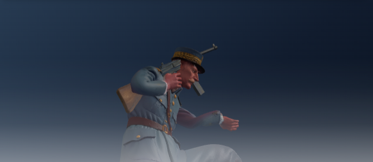
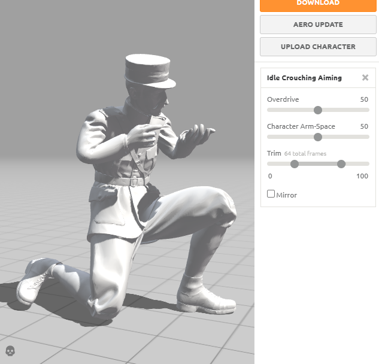
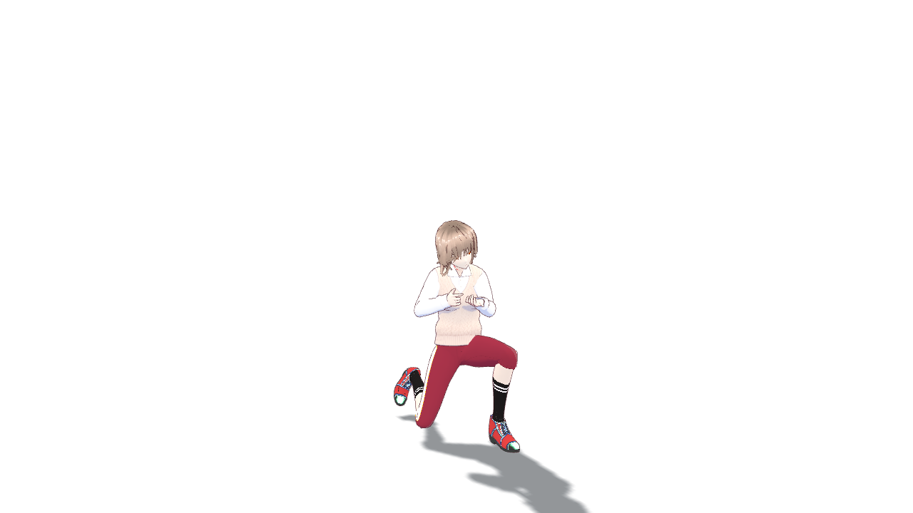

# 0.0.11 · Mixamo 动作修复

## 为什么手臂会跑偏？

动作文件里有一份“参考站姿”，人物模型里也有一份“原本的骨骼姿势”。旧版把这两份当成了一样的东西，又调整了一遍胳膊。你这段跪姿瞄准动作的前臂因此多转了约 28 度，手掌就离开了原本的位置。

还有一个问题：旧版把第一帧的腰部高度重置成站姿。跪着、坐着的动作就被抬高了。

## 对照图片

你反馈的旧版画面：

你提供的 Mixamo 参考画面：

修复后，用同一人物和同一段 Idle Crouching Aiming 动作实际渲染：

图片的镜头角度不同，所以另外逐个核对了动作文件中的旋转数据。这段动作共核对 1,312 个骨骼旋转关键点，最大角度差小于 0.001 度。图中暂时不显示物品，方便看清两只手和身体姿势。

同一动作放到 VRM 上，初始跪姿高度也得到保留：

## 怎么使用

1. 完整解压 0.0.11 程序包，打开新版 VRMGalgame.exe。
2. 打开原来的 `.vrmg` 工程，选择已经导入的动作。已有动作不用重新下载。
3. 在“角色”页选择这段动作，选择合适的动作定格帧，再点击“调整视角与物品”。
4. 让物品绑定到右手掌、左手掌或所需手指，使用位置和旋转的粗调、细调，把握把对准手掌。

**动作姿势和枪的握持位置是两件事。** 本次修复动作姿势；枪仍使用作者保存的绑定位置和旋转。如果以前为了迁就错误姿势调过枪，新版中可能需要重新微调一次。绑定到右手会跟着右手移动，另一只手不会自动贴到枪上，需要配合合适的持枪动作。

## 检查结果

- 真实 FBX 人物：跪姿瞄准、敬礼、坐姿鼓掌的骨骼旋转与同人物的原始动画核对通过。
- 另一种导出方式的两段动作：检查保留了原有旋转映射，没有把骨骼方向清空。
- Windows 编辑器：FBX 和 VRM 的跪姿高度、手掌绑定关系检查通过。
- 物品显示、手指绑定、转动视角、逐句登场、多人标题等已有功能检查通过。
- 11 组源码检查、网页构建和 Windows 程序构建通过。

开发者说明：FBX 动作转换优先使用蒙皮的绑定矩阵；不带人物身体的 Mixamo 动作，按文件中的 PreRotation/PostRotation 还原骨骼基准。没有这些数据的导出文件保留原有局部骨骼方向。腰部只把水平方向起点居中，保留纵向姿势高度。VRM 原有的标准站姿旋转转换保留。

骨骼基础姿势与绑定矩阵的关系可见 [Three.js Skeleton 文档](https://threejs.org/docs/pages/Skeleton.html)。示例截图来自作者提供的本地素材；程序包不附带这些人物、武器或 Mixamo 动作文件。
