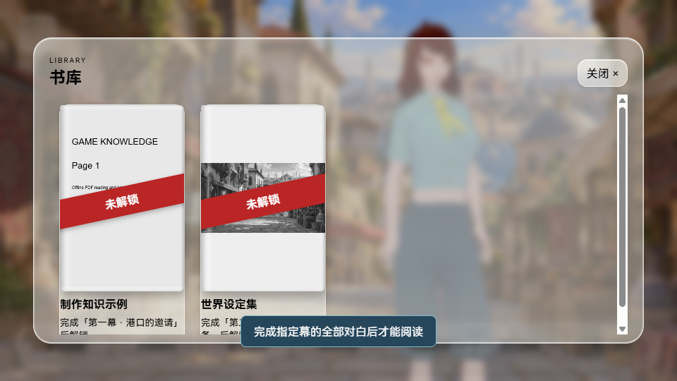

# VRM Galgame Editor · 0.0.7

[简体中文](../README.md) · [English](README.en.md) · [日本語](README.ja.md) · [한국어](README.ko.md)


A Windows editor for creating visual novels with 3D VRM characters. Arrange characters, dialogue, motion, backgrounds, and audio; preview the scene in a separate window; then export a playable game. The image above is a **feature illustration**, not a screenshot.

**0.0.7 is the latest public release** and includes the local v0.7.22 features. The previous 0.0.3 download remains available. This public edition does not bundle VRM models, Mixamo motions, or the sample story's assets. Import assets you have permission to use.

This release adds a five-tab asset library below the preview (Image, VRM, Motion, Audio, and Video), image thumbnails, clickable folders, double-click import, and file or folder drag-and-drop import. The earlier shadow-height slider and frame-by-frame pose selection remain available. Existing time-based poses migrate to frames. Manual portraits remain untouched. Earlier features include oil-paint rendering, portrait-only characters, off-stage dialogue, white editor, and night mode.

HarmonyOS Sans SC is used under its included license; the full license is at `../public/fonts/HarmonyOS_Sans_SC_LICENSE.txt` in the source and `web/fonts/` in the Windows download. Copyright © Huawei Device Co., Ltd.

## Features

- Organize dialogue and scenes into acts; control VRM expressions, motion, camera position, and depth.
- Import images, video backgrounds, music, and sound effects.
- Preview and test your game, then export a playable Windows build.
- Save a project as one portable `.vrmg` file.
- Provide player saves, autosaves, reading progress, and unlockable galleries.
- Adjust rendering options, including optional shared character shadows.

## Examples and visual previews

These examples and visual previews show the editor, title screen, and gameplay. The characters, background, and other example assets shown here are **not included** in the public download.

**Story editing example:** arrange acts, dialogue, characters, and backgrounds.


**Title screen preview:** a sample menu with a VRM character.


**Gameplay preview:** characters, background, and dialogue together.


## Download and start

1. Download `VRMGalgame-0.0.7-win-x64.zip` from [GitHub Releases](https://github.com/2396846264/-vrm-galgame-editor/releases).
2. Extract the **whole archive** and run `VRMGalgame.exe`.
3. Create a project or open an existing `.vrmg` file.
4. Import your own VRM, motion, image, and audio files; edit the cast and story; select **Preview** and then **Export Game**.

Requires Windows 10/11 x64 and Microsoft Edge WebView2 Runtime. The portable package includes the .NET runtime.

Supported imports: `.vrm` characters; `.vrma` and Mixamo `.fbx` motions; `.png`, `.jpg`, `.jpeg`, and `.webp` images; `.mp3`, `.wav`, and `.ogg` audio; `.mp4` and `.webm` video backgrounds.

## Build from source

On Windows, install Node.js, npm, and the .NET 10 SDK. From the repository root:

```powershell
npm ci
npm run build
dotnet publish Desktop/Desktop.csproj -c Release -r win-x64 --self-contained true -p:PublishSingleFile=true -o publish
Copy-Item -Recurse dist publish/web
```

Run `publish/VRMGalgame.exe`; retain `WebView2Loader.dll` beside it if present. Third-party character, motion, and story assets are not included. No reuse license for this project's source is granted by this repository.

Creator on Bilibili: [尸工U5十三世](https://b23.tv/krcyQ8I).


[Step-by-step Chinese guide with asset rules](新手说明书.md)


## 0.0.7

Story-wide find and replace with undo; game naming moves to Title settings. PDF knowledge library with chapter-completion unlocking, grayscale locked covers, and a red locked ribbon. Offline two-page reading includes paper and spine shadows, animated page turns, keyboard/swipe navigation, zoom, and remembered reading position. Per-chapter rendering, color grading, cover selection, and replay cards. Milky translucent glass menus with black text, clear title buttons that frost on hover, and borderless white dialogue with black shadows. Fixes the blank, unclickable book entry, settings scrolling, title music, startup conflicts, and duplicate automatic portraits.

[Illustrated guide / 図解 / 그림 설명](新功能说明_0.0.7.md)


