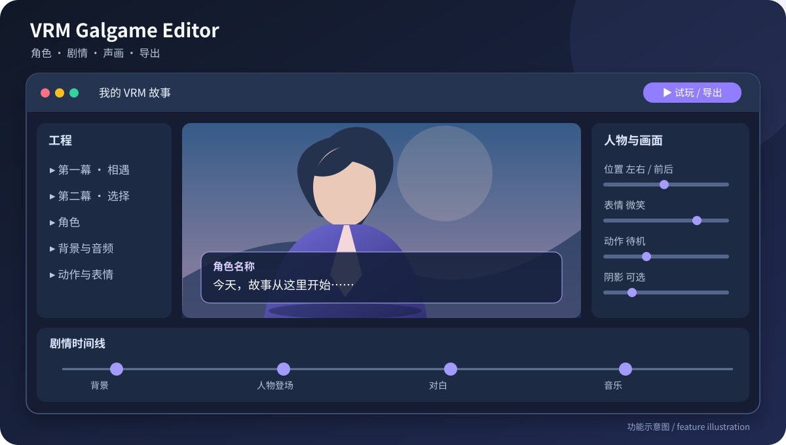
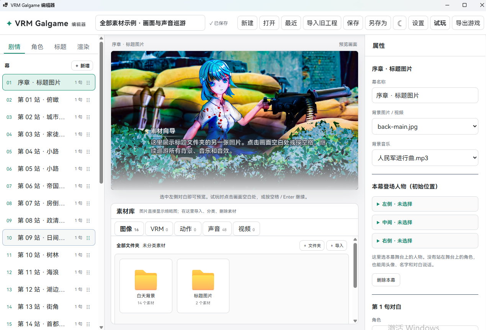
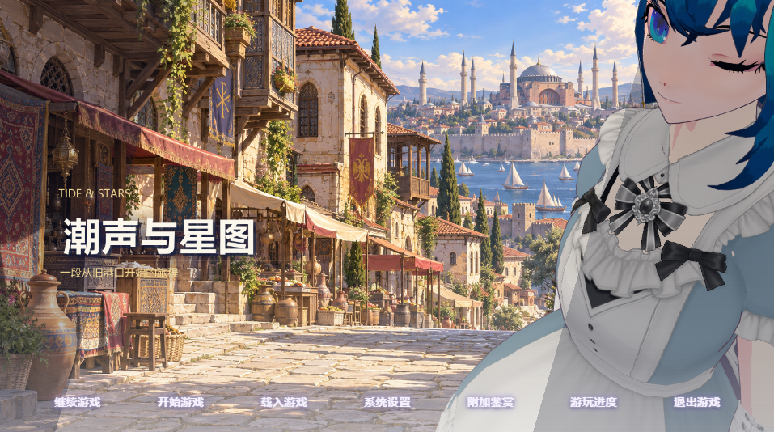
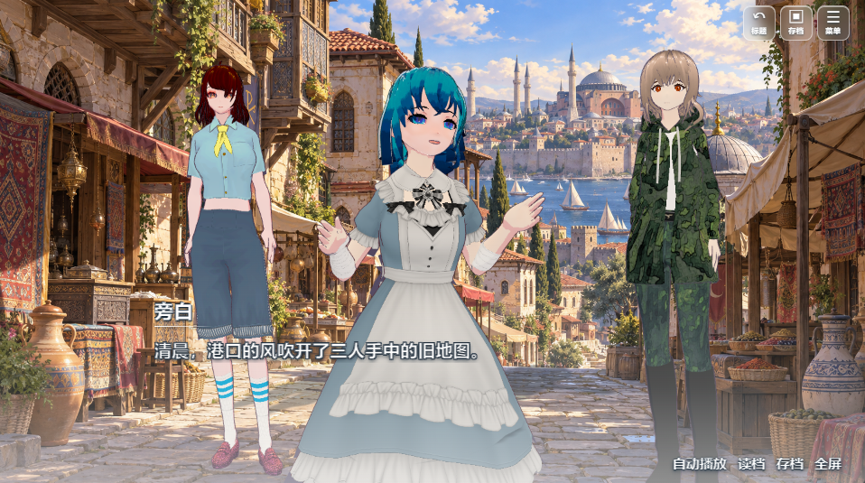

# VRM Galgame 편집기 · 0.0.1

[简体中文](../README.md) · [English](README.en.md) · [日本語](README.ja.md) · [한국어](README.ko.md)



3D VRM 캐릭터로 비주얼 노벨을 만드는 Windows 편집기입니다. 캐릭터, 대사, 동작, 배경, 소리를 배치하고 별도 창에서 시험 실행한 뒤 플레이 가능한 게임으로 내보낼 수 있습니다. 위 그림은 **기능 안내용 그림**이며 실제 화면 캡처는 아닙니다.

**0.0.1은 공개 버전 번호입니다.** 다운로드 파일에는 로컬 v0.7.7 기능이 반영되었습니다. VRM 모델, Mixamo 동작, 예제 이야기의 소재는 들어 있지 않습니다. 사용할 권리가 있는 소재를 가져오세요.

이번 업데이트에는 흰색 편집기와 야간 모드, 캐릭터 로딩 회전 애니메이션, 내장 HarmonyOS Sans SC 글꼴이 포함됩니다. 감상 화면의 캐릭터 이름은 초상화 위에서 ‘캐릭터 상세’로 옮겨졌으며 긴 이름도 줄바꿈됩니다. 기본 대화창의 기존 모습은 유지됩니다.

HarmonyOS Sans SC의 저작권은 Huawei Device Co., Ltd.에 있습니다. 전체 라이선스는 소스의 `../public/fonts/HarmonyOS_Sans_SC_LICENSE.txt`와 Windows 다운로드의 `web/fonts/`에서 확인할 수 있습니다.

## 주요 기능

- 막 단위로 이야기와 대사를 편집하고 VRM 표정, 동작, 위치, 앞뒤 거리를 설정합니다.
- 이미지, 동영상 배경, 음악, 효과음을 가져옵니다.
- 별도 창에서 시험 실행한 뒤 Windows 게임으로 내보냅니다.
- 프로젝트를 하나의 `.vrmg` 파일로 저장합니다.
- 저장, 자동 저장, 읽기 진행률, 감상 갤러리를 제공합니다.
- 공통 캐릭터 그림자를 포함한 렌더링 옵션을 조정합니다.

## 예시 및 효과 이미지

아래는 편집기, 제목 화면, 플레이 화면의 예시와 효과 이미지입니다. 이미지 속 예시 캐릭터와 배경 등의 소재는 **공개 다운로드 파일에 포함되지 않습니다**.

**이야기 편집 예시:** 막, 대사, 캐릭터, 배경을 배치합니다.



**제목 화면 효과 이미지:** 메뉴와 VRM 캐릭터의 예시입니다.



**플레이 화면 효과 이미지:** 캐릭터, 배경, 대사를 함께 보여 줍니다.




## 다운로드와 시작

1. [GitHub Releases](https://github.com/2396846264/-vrm-galgame-editor/releases)에서 `VRMGalgame-0.0.1-win-x64.zip`을 다운로드합니다.
2. ZIP **전체를 압축 해제**하고 `VRMGalgame.exe`를 실행합니다.
3. 새 프로젝트를 만들거나 기존 `.vrmg` 파일을 엽니다.
4. 자신의 소재를 가져와 캐릭터와 이야기를 편집하고, 시험 실행으로 확인한 뒤 게임을 내보냅니다.

Windows 10/11 x64와 Microsoft Edge WebView2 Runtime이 필요합니다. 배포 ZIP에는 .NET 런타임이 포함됩니다.

지원 형식: 캐릭터 `.vrm`, 동작 `.vrma` / Mixamo `.fbx`, 이미지 `.png` / `.jpg` / `.jpeg` / `.webp`, 오디오 `.mp3` / `.wav` / `.ogg`, 동영상 배경 `.mp4` / `.webm`.

## 소스 빌드

Windows에 Node.js, npm, .NET 10 SDK를 설치하고 저장소 루트에서 실행합니다.

```powershell
npm ci
npm run build
dotnet publish Desktop/Desktop.csproj -c Release -r win-x64 --self-contained true -p:PublishSingleFile=true -o publish
Copy-Item -Recurse dist publish/web
```

`publish/VRMGalgame.exe`를 실행합니다. `WebView2Loader.dll`이 있으면 EXE 옆에 유지하세요. 제삼자 소재는 포함되지 않습니다. 이 저장소는 프로젝트 소스의 재사용 라이선스를 부여하지 않습니다.

제작자 Bilibili: [尸工U5十三世](https://b23.tv/krcyQ8I).


