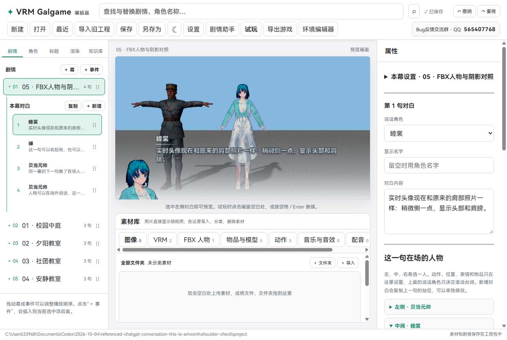
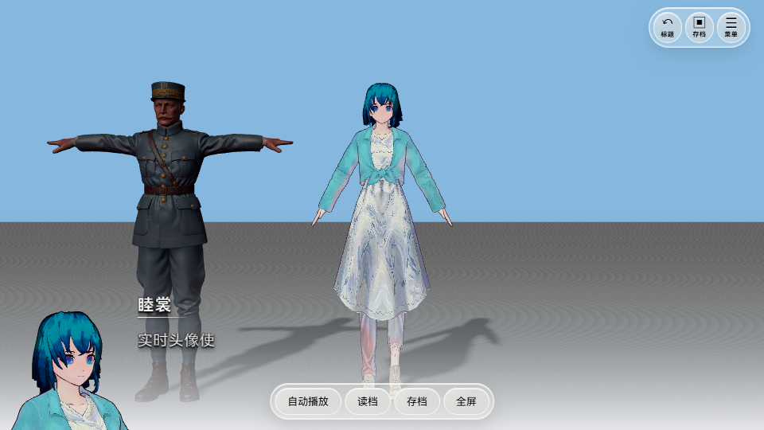

# 0.0.14 · VRM 头像恢复肩部照片角度

VRM 实时头像现在按照原来自动拍摄的肩部照片显示：**从人物正面稍偏一侧拍，显示头部、肩膀和一点胸口**，保持原来左下角头像的大小。

## 实际效果

实时头像和自动照片共用同一套拍摄方向与放大比例，头像靠左下角摆放。人物在场上变大、变小或转身时，头像继续保持肩部近景，不会改变场上的人物位置。

**嘴型、眨眼和表情仍然同步。** 头像直接拍摄同一个 VRM 模型，不另加载一份人物。

## 哪些角色生效

| 角色类型 | 对话头像 |
| --- | --- |
| VRM | 使用实时肩部近景，同步嘴型和表情 |
| FBX | 使用手动上传的 PNG 头像 |
| 没有人物模型的角色 | 使用手动上传的 PNG 头像 |

这次功能只对 VRM 生效。FBX 和图片角色不会自动拍摄，也不会使用实时模型头像。

需要给其他角色设置头像时，打开“角色”，选择该角色，点击 **上传 PNG 头像**。已有的头像图片和尺寸显示方式继续保留；没有上传头像的其他角色不会自动显示人物照片。

## 使用新版

完整解压 `VRMGalgame-0.0.14-win-x64.zip`，打开新的 `VRMGalgame.exe`，再打开原来的 `.vrmg` 工程即可。无需重新导入 VRM。以前导出的游戏需要用新版再导出一次。

0.0.13 的天空描边修复、环境自动保存、暗场景光照，以及此前的物品绑定、逐句人物设置和 GLB 场景动画继续保留。

## 验证

15 组源码检查、网页构建和 Windows 构建通过。实际检查了蓝发 VRM 的拍摄角度、放大比例、嘴型变化，FBX 上传 PNG、纯图片角色，以及导出的独立游戏。

截图仅展示实际效果，公开下载包不附带第三方人物模型和私人工程。
