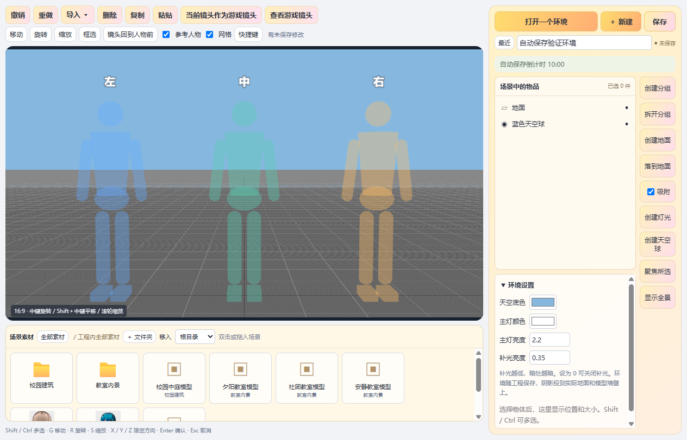
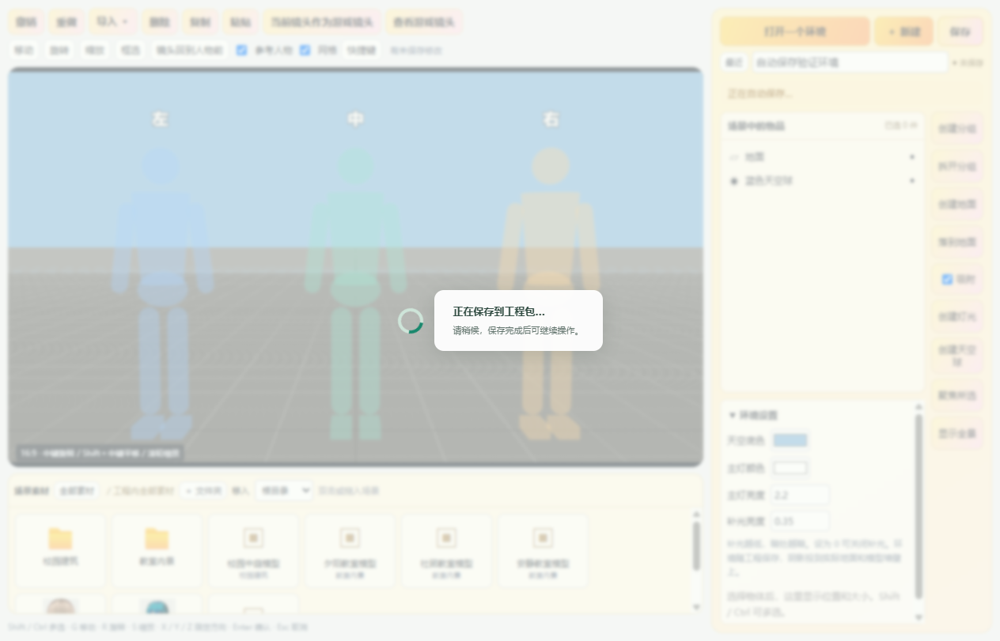
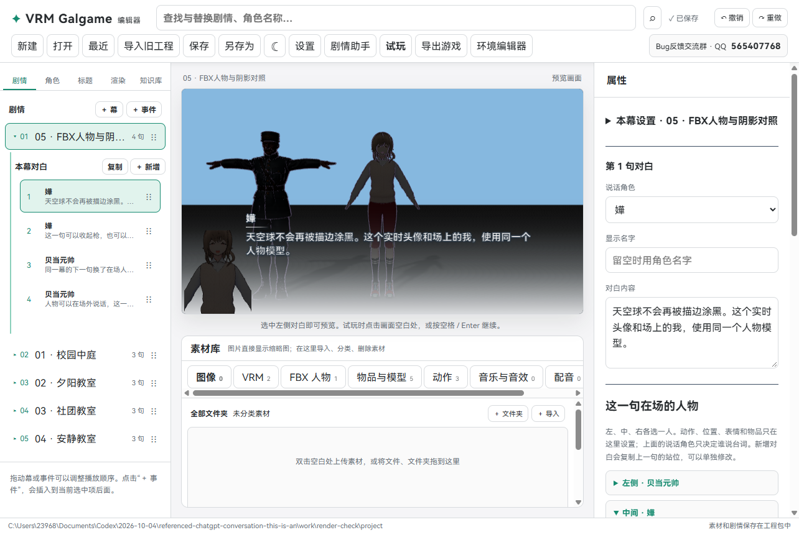
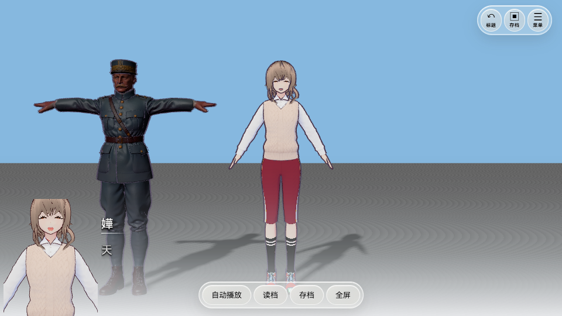

# 0.0.13 · 天空描边修复、自动保存与实时头像

## 天空球不再变黑

以前打开描边后，天空球也被包上一层黑色外壳。镜头在球里面，就看到了黑色的天空。

现在天空球会跳过描边。**人物和场景物体仍然正常描边，天空保持原来的颜色或全景贴图。** 不用重新创建天空球，打开原工程就能使用。

已经检查关闭描边、细、中、粗四种设置。纯色天空和带贴图天空都正常。

## 环境编辑器每 10 分钟自动保存

打开环境编辑器后，右侧环境名称下面会出现 **自动保存倒计时 10:00**。

1. 剩下 5 秒时，会提示“5 秒后自动保存，请稍候”。
2. 正在拖动物体、输入数值或操作弹窗时，等待当前操作结束再保存。
3. 保存时会显示“正在保存到工程包…”和旋转的小圈。
4. 保存完成后，提示消失，倒计时回到 10:00。手动保存也会重新计时。
5. 没有修改时，不重复压缩工程；保存失败会显示原因，并在 30 秒后重试。

工程包的压缩放到后台进行，让提示和动画能继续刷新。为了保护正在写入的文件，保存期间暂时不能改场景、导入文件或关闭窗口。模型很多时保存仍需要时间，请等待提示消失。

**保存的是当前工程里的环境**，包含物体位置、灯光、摄像机和场景素材文件夹，随 `.vrmg` 工程包一起保存。主编辑器原来的自动保存设置继续保留。

## 暗场景中的人物跟随场景灯光

删除了旧的“根据背景自动配光”和“背景配光强度”选项。

3D 环境现在统一使用场景灯光。人物材质中自带的亮光、固定边缘亮光和固定高光不会再把人物照得特别亮；人物和物品继续使用实际地面、墙壁的阴影。

环境设置增加 **补光亮度**。数值越低，阴影和暗处越暗；`0` 是关闭补光。原来没有这个设置的环境会自动采用较低的补光，不需要手动修改工程文件。

天空、保持原亮度的图片布景，仍按各自的设置显示。该处理针对人物，不会把夜景灯牌等场景材质的发光全部删除。

## VRM 对话头像改成实时模型

VRM 对话人物的左下角头像现在是一台专门拍摄脸部的镜头，**直接拍摄同一个人物模型**。

- 场上的人物张嘴、眨眼或改变表情，头像同步变化。
- 不需要再导入一份 VRM，也不会为同一个人物重新加载另一份模型。
- 人物在场外说话时，也可以显示实时头像，不占用左、中、右的位置。
- 切换到 FBX 说话人物时继续使用普通图片头像；FBX 不增加表情或口型控制。
- 素材库的 VRM 内置缩略图、角色鉴赏图片和手动上传的头像文件继续保留。VRM 模型暂时无法显示时，可以回退到图片头像。

头像多绘制一次当前人物的近景，运行时仍会有少量额外绘制开销。头像与人物共用动作和表情，不会额外运行第二套角色动画。

## 怎么换成新版

完整解压 `VRMGalgame-0.0.13-win-x64.zip`，打开新文件夹里的 `VRMGalgame.exe`，再打开你原来的 `.vrmg` 工程。

旧工程可以继续打开。想让以前导出的独立游戏也有这些修复，需要用新版重新导出一次。

## 已完成的验证

15 组源码检查、网页构建和 Windows 程序构建通过。实际编辑器验证了纯色/贴图天空的四档描边、暗场景材质、实时嘴型与表情、场外头像、切换 FBX、后台保存、倒计时重置与保存后的工程重开。独立游戏中的实时头像也通过检查。

测试工程约 118 MB；压缩过程中界面计时继续刷新，保存后环境版本正确增加。图中人物和素材仅用于展示效果，不附在公开下载包中。
