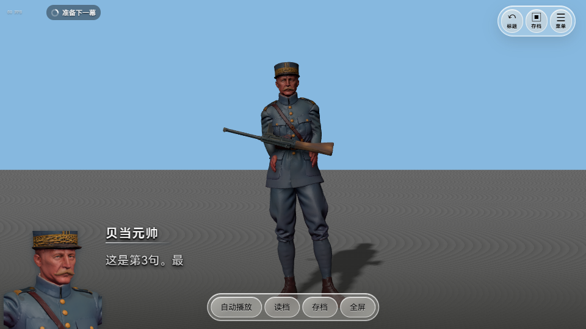
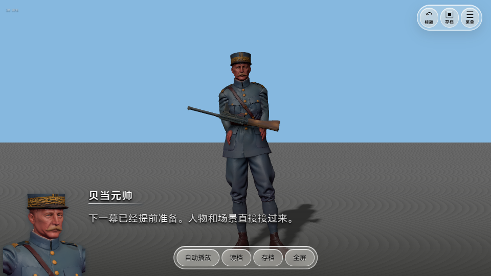

# 0.0.17 · 按当前帧数提前准备下一幕

游戏播放到一幕最后三句时，会根据最近约一秒的实际画面帧数，决定是否提前准备下一幕。只观察帧数，不读取玩家的 CPU、显卡型号或电脑配置。

| 当前 FPS | 策略 | 提前准备什么 |
| --- | --- | --- |
| 高于 55 | 完整预加载 | 下一幕环境、各句需要的人物、动作、物品、头像和声音，以及渲染准备 |
| 30～55，包含 30 和 55 | 部分预加载 | 下一幕环境、开场人物与动作、开场物品、必要头像和声音，以及开场渲染准备 |
| 低于 30 | 不开始新预加载任务 | 沿用正常的资源加载方式；已有准备结果可以复用 |

例如一幕有 20 句，会从第 18 句开始。短幕不足三句时，从进入该幕开始。左上角有很小、半透明的 FPS 数字，旁边是“准备下一幕”的转圈；加载完成或暂停准备时，转圈会隐藏。

帧数下降后暂停后续准备，恢复后继续；高帧数时可从部分升级成完整。当前正在解析的一份资源会先完成，再判断下一项任务。菜单、切到后台和返回标题时也会暂停或取消相应工作。准备过程不会提前播放下一幕音乐、改变当前人物动作、镜头或环境。

## 换幕怎样变快

下一幕使用单独的场景和人物缓存。正式切换时直接接过准备好的模型、动作、物品和环境，而不是先清空再重新读一遍。声音提前加载但不提前播放。已经准备好开场资源时，后续人物按对白实际需要使用缓存或加载。

贴图和渲染程序也会分批提前准备。预加载不代表所有电脑都能完全消除停顿：大型模型的解析、显卡工作和玩家快速点击仍可能造成剩余等待。未准备完成或准备失败的资源，正式进入时继续按正常流程加载。

## 分支、读档和返回标题

顺序剧情或唯一分支目标可以提前准备。多个不同分支目标尚未选定时，不猜路线、不同时装入多套场景；选择后按正常方式进入。读档和章节重玩会重新核对目标，丢弃不适用的准备结果。返回标题会清理准备区。

FPS 是最近约一秒的连续画面采样，刚开始采样会短暂显示“— FPS”。没有新增帧数历史记录或硬件收集。显示的是实际采样值；策略判断使用未四舍五入的数值，因此临界附近显示整数和档位可能短暂看起来相邻。

## 怎样更新

完整解压新版，双击 `VRMGalgame.exe`，打开原工程。已有工程无需重新填写设置。旧的独立游戏需要重新导出，才能带上这次优化。

## 实际检查

19 组源码检查通过，包括 30 / 55 的边界、短幕、分支目标、部分升级完整、低帧暂停、取消、预加载错误和切幕交接。Windows 编辑器、工程包重开与独立游戏均验证了场景和人物复用。VRM 实时头像及 FBX 静态头像保持正常。

档位测试用 25 / 45 / 60 FPS 控制值逐项验证策略，另检查真实帧采样；控制值只在测试入口生效。截图人物为本地测试素材，公开下载包不包含这些模型和示例工程。
