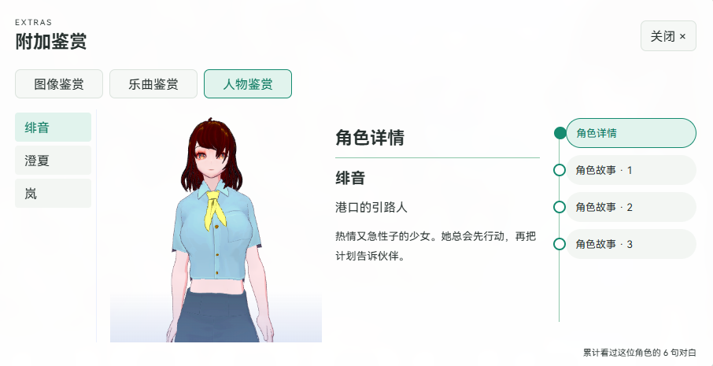
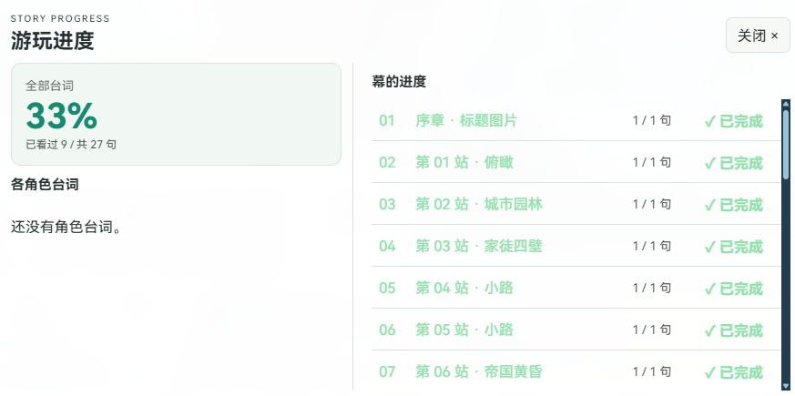
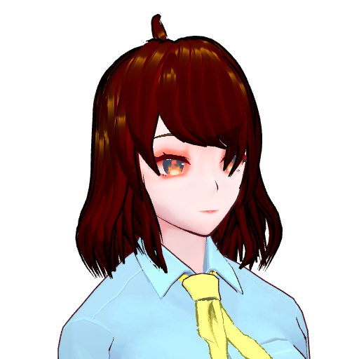
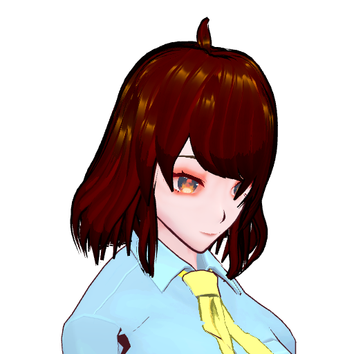
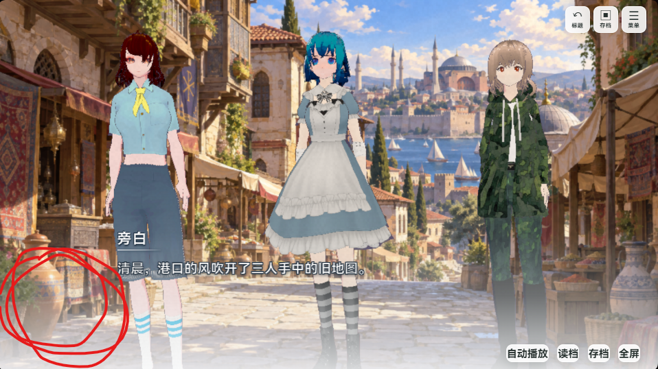

# 小白也能用的 VRM Galgame 图文说明书

这是一台“故事拼装机”：放进人物、背景、声音，写几句话，就能做成自己能玩的游戏。**先做一个很短的小故事**，成功后再慢慢加东西。

> 这里的图片都是**示例与效果图**。图里的示例人物、背景、动作和故事不在公开下载包里。

## 第 1 步：下载并打开

1. 到 [最新版下载页](https://github.com/2396846264/-vrm-galgame-editor/releases/latest) 下载 `VRMGalgame-0.0.6-win-x64.zip`。
2. 右键 ZIP，选“全部解压”。**把整包都解压出来**，别只把 `VRMGalgame.exe` 拖出来。
3. 打开解压后的文件夹，双击 `VRMGalgame.exe`。
4. 点“新建”，给故事起名，选一个保存位置。会得到一个 `.vrmg` 文件，它就是你的“故事盒子”。

电脑需要 Windows 10/11 64 位和 Microsoft Edge WebView2 Runtime。如果程序提示缺少 WebView2，请先安装微软的 WebView2 Runtime，再打开编辑器。

## 第 2 步：准备素材

“素材”就是要放进故事里的东西。你可以先只准备 **一张背景图、一张头像**，再写对白；没有 3D 人物也能开始。

| 要放的东西 | 能导入的格式 | 建议怎么准备 |
| --- | --- | --- |
| 3D 人物 | `.vrm` | 一个角色一个文件；先确认能在编辑器里正常显示。 |
| 人物动作 | `.vrma`、Mixamo `.fbx` | 先选简单的站立或说话动作；`.fbx` 请使用 Mixamo 动作。 |
| 背景、标题图 | `.png`、`.jpg`、`.jpeg`、`.webp` | 横向图片建议 16:9，例如 1920×1080 像素；文字和重要人物别贴边。 |
| 角色头像 | `.png`、`.jpg`、`.jpeg`、`.webp` | 建议 512×512 像素或更清楚；想要透明背景，请用带透明通道的 PNG 或 WebP。 |
| 音乐、音效 | `.mp3`、`.wav`、`.ogg` | 先试听，确认声音大小合适、文件能播放。 |
| 视频背景 | `.mp4`、`.webm` | 先用短视频试播；能否播放还和视频内部编码有关。 |

**“建议”不是程序的硬性门槛。** 编辑器检查的是上表的文件扩展名；图片太小会模糊，文件太大会让载入和导出变慢。`故事名.vrmg` 是工程包，不是图片，也不用手工往里面塞文件。

新版的素材库在预览画面下方。上方有“图像、VRM、动作、声音、视频”五个标签；图片会显示缩略图。点文件夹可以进入，点“← 返回”回到外层。空白处双击可以导入，也可以把文件或文件夹拖进来，程序会自动按格式分类。

文件名尽量短、能看懂，例如 `港口早晨.png`、`主角头像.png`、`聊天动作.fbx`。不要把 `.jpg` 直接改名成 `.png`；改名字不会改变文件内容。素材最好放在自己记得住的文件夹里，导入后用编辑器管理。

## 第 3 步：做人物

点“角色”，再点“新增”。给角色起名。

- **有 VRM 的角色：**选择 VRM 模型。编辑器会尝试自动拍一张透明的头肩头像，脸稍微朝右。选好“鉴赏姿势／动作”后，在“动作定格帧”里选第几帧；也可以直接输入帧号。
- **没有模型的角色：**不用选 VRM，点“上传头像”选一张图片。这样的角色也能说话，适合不出现在画面中的主角、电话里的人等。
- 如果自动拍得不满意，可以点“重新拍摄 VRM”，或者自己上传头像。**手动上传的头像不会被自动重拍盖掉。**

角色页的整体布局如下。这是上一版的示例截图；最新版右侧改为“动作定格帧”。

最新版的定格帧和阴影高度控件示意图：

同一个动作，换一帧，头像表情和姿态可能不同：

| 动作开始（第 1 帧） | 同一动作的第 73 帧示意 |
| --- | --- |
|  |  |

## 第 4 步：写一小段故事

点“剧情”，新增一幕，选背景，再新增对白。先写两三句话就好。

这一幕的“本幕登场人物”控制画面上站着谁。**说话的人可以不在画面里**：给他选好角色后，游戏只显示头像、名字和台词，不会硬把第 4 个模型塞上舞台。旁白不显示角色头像。

这张示例图的红圈标出了说话头像出现的位置：

## 第 5 步：看效果、保存、导出

1. 点“试玩”，像玩家一样从头玩一遍。
2. 有地方不对，就回到“剧情”“角色”或“素材”修改。
3. 点“保存”。你的故事和导入的素材会写进一个 `.vrmg` 工程包。
4. 点“导出游戏”，选一个空文件夹。导出完成后，把**整个游戏文件夹**交给别人，别只拿 EXE。

标题画面与游玩效果可以长这样：

## 画面想再漂亮一点

“渲染”页可以打开人物阴影和“油画笔触（人物与背景）”。油画强度先调低，看看人物和背景是否都喜欢；电脑运行变慢就把强度调小或关闭。默认对白框保持原来的样子。顶部月亮按钮可以把白色编辑器切换成夜间模式。

如果人物像浮在影子上方，展开“高级渲染 · 角色阴影”，把“阴影水平高度”往右拖，让影子靠近鞋底。这个滑块同时调节画面里的所有人物。建议一边看预览一边慢慢调，不必照抄某个数值。

站着说话时，脚掌固定能减少脚在地面上滑动。需要走路、跳跃等动作时，可以到“高级动作选项”调整脚掌固定和动作走位。

## 一定记住的 5 件事

1. **每做完一段就点“保存”。**大改之前用“另存为”留一份旧版本。
2. **换电脑带走 `.vrmg`。**这是编辑用的工程。给玩家的是“导出游戏”生成的整个文件夹。
3. **只用你有权使用的素材。**模型、动作、音乐、图片、视频和字体都有各自的使用规则；能自己用，不一定能公开发布。
4. **公开下载包没有示例素材。**看到这本说明书的示例图，不代表下载后自带那些人物、背景或故事。
5. **别乱改导出文件夹里的文件。**要修改游戏，回到编辑器改工程，再重新导出。

## 卡住了怎么办

| 看到什么 | 先做什么 |
| --- | --- |
| 程序打不开 | 确认 ZIP 已全部解压，EXE、`web` 文件夹和 `WebView2Loader.dll` 在一起；检查 WebView2 Runtime。 |
| 模型不出现 | 确认导入的是 `.vrm`，并且在该幕的“本幕登场人物”里选中了它；加载时先等转圈结束。 |
| 头像不出现 | 在“角色”里确认有头像；VRM 自动头像生成后，请保存工程。旁白不会显示头像。 |
| 背景或声音不出现 | 去中间的“素材库”确认文件已经导入，再检查当前幕是否选中了它。 |
| 旧工程打不开 | “打开”用于 `.vrmg` 工程包；旧版含 `project.json` 的文件夹请用“导入旧工程”。 |

还想看完整功能？回到 [仓库首页](../README.md)。作者 B 站：[尸工U5十三世](https://b23.tv/krcyQ8I)。
