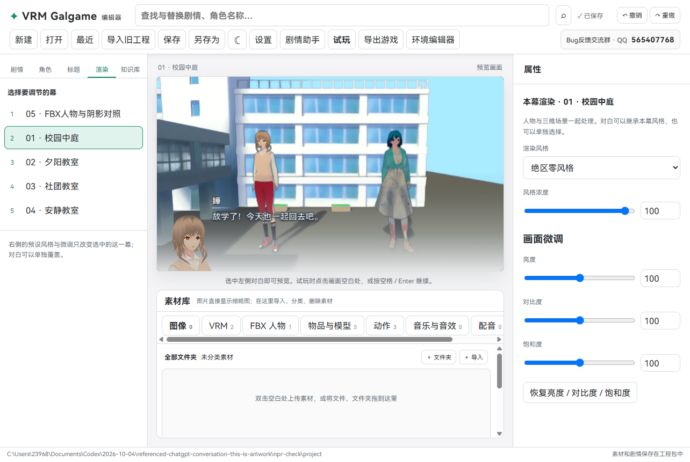
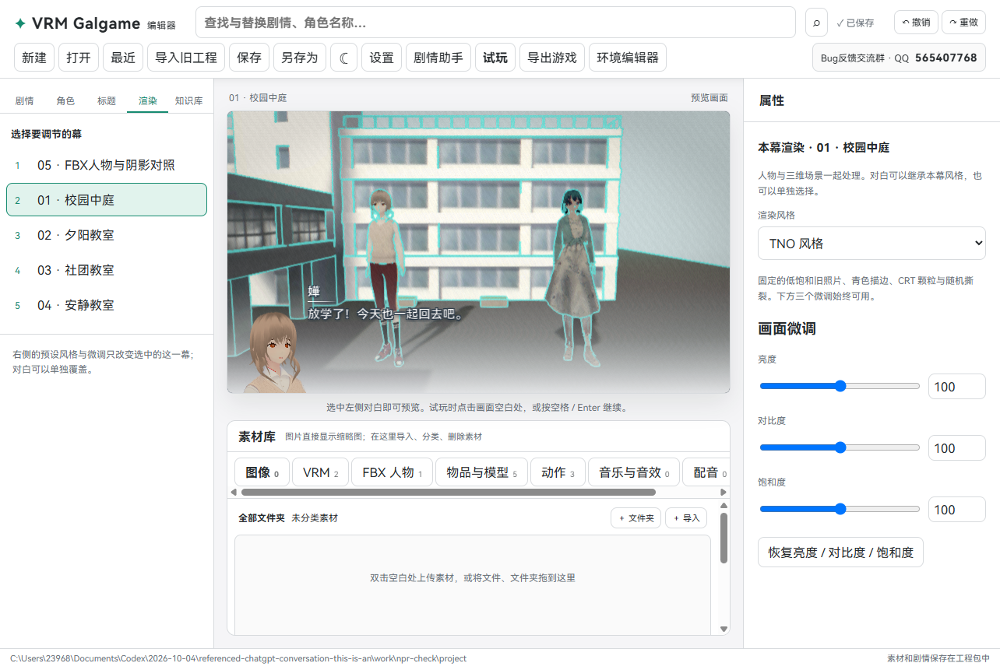
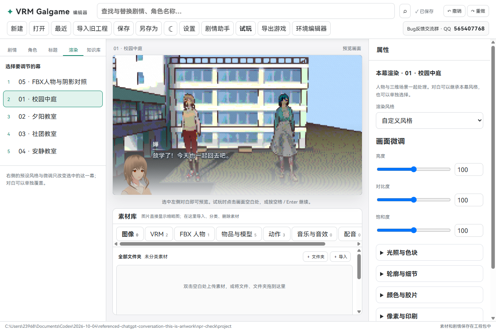
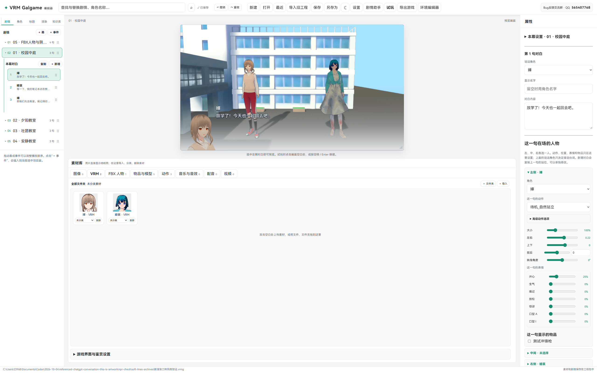

# 0.0.18 · 新渲染与可拖拽预览

渲染页重做为三种风格。旧的三渲二、油画、电影色调和独立描边选项已经移除。人物与三维场景一起处理；对白可以继承本幕设置，也可以单独选择风格。

| 风格 | 效果 | 可调整内容 |
| --- | --- | --- |
| 绝区零风格 | 明亮、较高饱和、简化色块、深灰蓝细描边，背景线条更轻 | 风格浓度，加亮度 / 对比度 / 饱和度 |
| 自定义 | 自己组合光照、描边、颜色、胶片、印刷与 CRT | 29 项滤镜，加三个微调 |
| TNO | 低饱和旧照片、亮青色轮廓、CRT 颗粒与扫描线、随机横向撕裂 | 仅三个微调，没有浓度滑块 |

绝区零预设依据作者给出的截图调整色块、明暗和轮廓。现有模型造型、贴图与构图也会影响最终相似度。不是把整个画面简单拉高饱和度：材质光照分段、边缘保留的细节简化，以及场景深度 / 法线描边一起工作。人物线条使用深灰蓝，减轻了皮肤黑斑和过粗轮廓；天空跳过几何描边。

TNO 撕裂是画面模拟，不会改变显示器实际刷新率。三维画面使用滤镜，文字和菜单保持清楚。系统设置减少动画时会减少动态撕裂和颗粒变化。

## 自定义有哪些选项

- 光照与色块：色块光照、细节简化、色调分离级数、环境光遮蔽、遮蔽范围。
- 轮廓与细节：描边粗细与颜色、内部结构线、锐化、柔化、浮雕。
- 颜色与胶片：曝光、伽马、色相、冷暖、绿紫偏色、棕褐色旧照片、黑白、反相、暗角、亮部光晕。
- 像素与印刷：像素块、半色调网点、阴影排线、有序抖色。
- CRT 显示器：颗粒、扫描线、色差偏移、随机画面撕裂。

## 每句对白也可以选

在“剧情”选一句对白，展开“这一句的渲染风格与微调”。选择“使用本幕风格”或指定预设。即使是固定的 TNO，亮度、对比度、饱和度仍然可以调整。渲染页预览本幕设置，剧情页预览该句的实际设置。风格不改变人物动作、位置和环境镜头。

## 调整预览大小

预览默认限制大小，给下方素材库留出空间。在 2560×1600 等大屏上，预览不会再撑满中间区域。

- 拖右边、底边或右下角的小手柄，放大或缩小预览。
- **始终锁定 16:9**，不会把画面拉宽或压扁。
- 鼠标移出手柄也能继续拖动，松开结束。
- 双击手柄恢复默认；手柄获得焦点时也可以用方向键调整，Home 恢复默认。
- 调整后的大小记在本机，下次打开继续使用；不会写入故事工程，也不占剧情撤销步骤。
- 窗口变小时自动限制大小，保持素材卡片完整。导出的玩家画面保持原来的 16:9 布局。

## 更新与检查

完整解压新版，打开其中的 VRMGalgame.exe，再打开原工程。旧工程保留亮度、对比度、饱和度并迁移渲染结构。旧的独立游戏需要重新导出。

20 组源码检查、Windows 构建、三种风格、浓度变化、29 项滤镜控件、对白微调、VRM / FBX 同场景、工程重开与独立游戏通过。布局检查覆盖 2560×1600、2048×1280、1707×1067、1280×800、1280×720；真实指针拖动、比例锁定、大小记忆和恢复默认通过。公开程序包不包含截图人物模型和作者故事工程。
