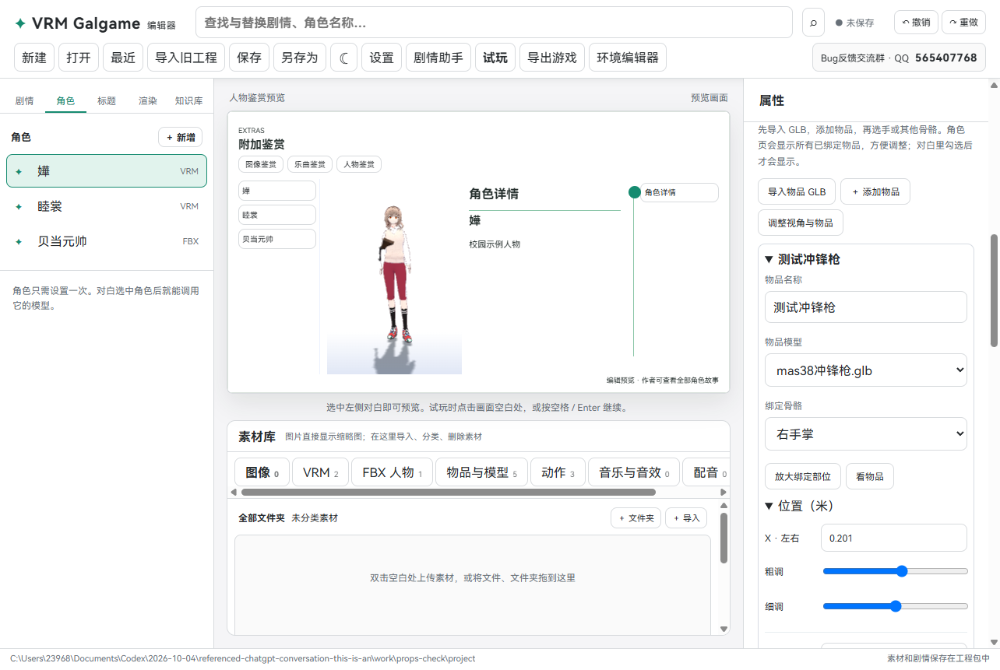
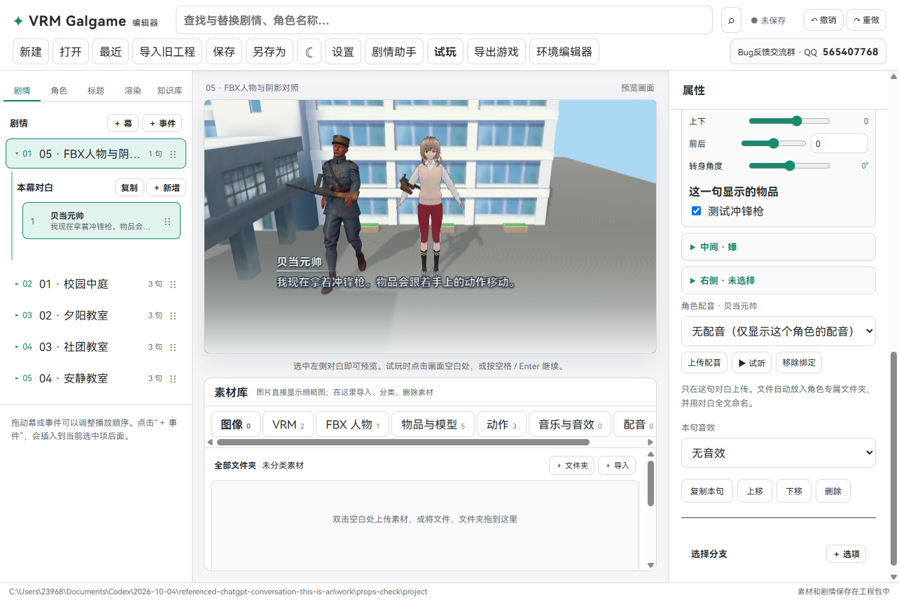

# 0.0.10：拿物品、逐句安排人物、多人标题

这次可以让 VRM 或 Mixamo FBX 人物拿着 GLB 物品。每句对白都有自己的在场人物设置；标题也可以同时放更多人物。

## 1. 给角色绑定物品

打开“角色”页，选中人物，往下找到“绑定物品”。点击“导入物品 GLB”，选择模型，然后点击“＋ 添加物品”。

选择物品模型和要绑定的骨骼，例如右手掌、左手掌、头或背部对应的骨骼。两只手的拇指、食指、中指、无名指、小指都按关节提供中文选项，例如“右手食指第三节”。模型没有的骨骼不会显示。物品会跟着所选的骨骼移动。

位置、旋转、缩放都分 X、Y、Z 三个方向，每个方向有数字输入、粗调和细调。先用粗调找到大致位置，再用细调靠近手掌。松开细调后，滑动条回到中间，已经调好的数值会保留。

- 位置按米填写。细调一格为 0.001 米。
- 旋转按角度填写。细调一格为 0.1 度。
- 缩放的 1 表示导入时整理后的大小。细调一格为 0.001。

角色页会显示所有已绑定的物品，方便调整；对话里需要勾选才会显示。可以给同一个角色绑多个物品。

绑定负责让物品跟着骨骼移动。想要人物握紧铲子或双手端枪，还需要选择合适的持物动作，再调整物品位置。当前不会自动摆手指，也不会自动让另一只手抓住枪。

### 绑定时转动视角

点击“调整视角与物品”，中间会切换成更大的 3D 调整画面。

- 左键拖动：从不同方向看人物。
- Shift＋左键拖动，或右键拖动：上下左右平移视角。
- 鼠标滚轮：拉近或拉远。
- “放大绑定部位”：把镜头对准所选的手掌或手指。
- “看物品”：对准这件物品。
- “看整个人物”：恢复能看到全身的视角。
- “返回人物鉴赏”：回到原来的人物预览。

调整右侧的粗调、细调或数值时，镜头会保持当前角度。检查用视角不会改变对白或标题里的实际人物位置，离开角色页后会恢复游戏镜头。

## 2. 每句对白分别安排三个人

选择一句对白，在上面选择“说话角色”并填写文字。下面的“这一句在场的人物”分别设置左、中、右三个位置。

展开一个位置，可以选择角色、动作、动作范围、大小、左右上下前后位置、转身、VRM 表情，以及这句显示哪些物品。FBX 人物不显示表情口型选项。

说话角色只决定谁说话，人物动作和位置只在下面设置一次。原来对白上方重复的动作、单人位置和大小调整已经移除。

下一句可以换人、收起枪，或改变动作和位置，上一句保持原样。新增或复制对白会复制上一句的站位，之后可以单独修改。三个位置都留空时，人物仍能在场外说话。

一**句**最多显示三个人；一**幕**中先后出现过多少角色，不再由开场三个人限制。

## 3. 标题画面放更多人物

点击“标题”，在右侧点击“＋ 添加标题人物”。可以反复添加 VRM 或 FBX，也可以重复使用同一个模型。

每个人分别选择模型、动作、大小、位置和转身角度。“使用角色及其物品”可以关联已经建好的角色，再勾选标题上显示的物品。不同人物互不影响。标题没有对白的三人限制；人物越多，对电脑的要求也越高。

左边的“导入标题 VRM 人物”和“导入标题 FBX 人物”会把新导入的模型加入标题。导入标题动作后会给最后添加的标题人物使用，也可以在右侧重新选择。

## 4. 左边的标题板可以完全隐藏

在“Logo 图片”里选择“不显示（留空）”。左边的白色标题板、游戏名称和 VRM GALGAME 字样都会消失，底部菜单仍然显示。

选“使用游戏名称”时恢复文字标题，选择一张图片时显示 Logo。隐藏标题板不会删除工程名字。

## 5. 保存与导出

物品绑定、每句在场人物、多标题人物和 Logo 留空设置都随 `.vrmg` 工程保存。已经导出的旧游戏，请重新导出，才能使用新版功能。

旧工程打开后会转成新版结构，原来的站位、动作、大小和标题人物会转换保留。请使用新版继续编辑。

## 检查结果与公开包

已使用作者提供的冲锋枪、Mixamo FBX 人物和 VRM 人物检查：手掌与手指关节绑定、视角旋转平移缩放、近看绑定部位、粗调细调、绑定骨骼、随动画移动、逐句显示隐藏、换人、空舞台、单次动作结束、同模型多个标题人物、Logo 留空、保存重新打开，以及导出游戏。

截图中的模型和动作是作者本地测试素材。GitHub 公开程序包包含程序和说明，不附带这些第三方模型、动作或本地示例工程。
