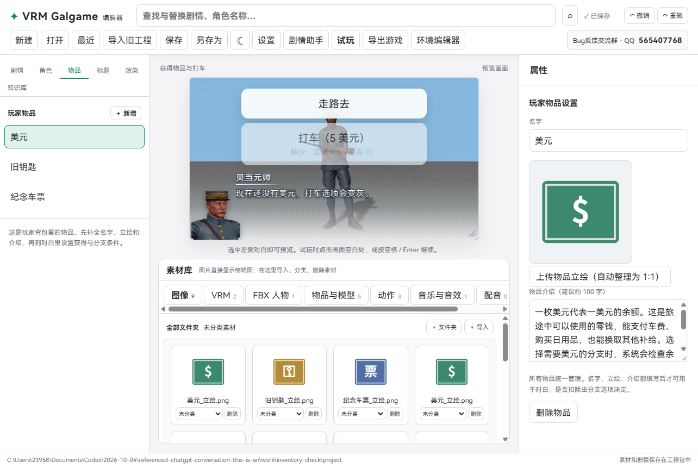
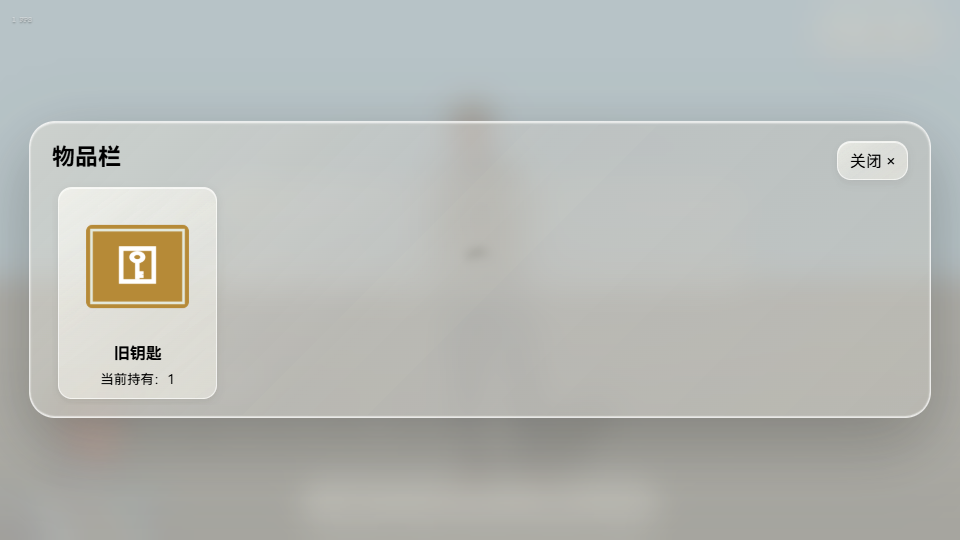
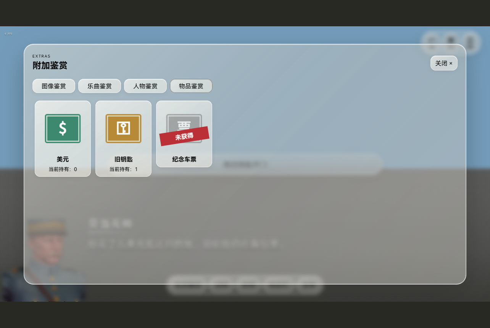

# 0.0.19 · 玩家物品栏与物品分支

玩家现在可以在对白中获得物品，把它们带在背包里，并用物品数量解锁分支。所有物品统一管理，不分消耗品或工具。是否扣除由每个选项的勾选框决定。

## 1. 创建物品

点击左侧“物品”，新增一个物品，填写名字、立绘和介绍。介绍建议约 100 字。上传的图片会生成一份 512×512 的正方形 PNG，保持原图完整、居中留透明边，不会切掉细长物品，也不会改动原文件。

三个内容都填好后，物品才会出现在对白和条件列表里。新物品草稿可以先保存，使用它的对白和分支在导出前必须设置完整。

## 2. 在对白中获得

选择一句对白，展开“这一句获得的物品”，添加物品与数量。对白显示完后，屏幕中心展示立绘，额外的对话框写出“玩家获得了：物品名字 × 数量”。多个物品会依次展示，点击“继续”或按空格 / Enter 确认。

同一存档中，同一句对白不会重复发放。获得提示尚未确认时，存档也保留已获得数量与待确认提示，读档后继续确认，不会再发一遍。

## 3. 分支条件与是否扣除

在选项下展开“所需物品条件”，添加一个或多个物品与所需数量。多个条件需要全部满足。

| 示例选项 | 所需物品 | 选择后扣除所需物品 |
| --- | --- | --- |
| 走路去 | 无 | 不勾选 |
| 打车 | 美元 × 5 | 勾选，选择后扣 5 美元 |
| 用钥匙开门 | 旧钥匙 × 1 | 不勾选，选择后钥匙保留 |

不勾选只检查是否持有；勾选会扣除上面列出的全部所需数量。任何物品都可以扣除或保留，完全取决于这一条选项。钱不够时，打车按钮变灰，并显示“缺少美元 × 5（现有 0）”；玩家不能通过点击灰色按钮绕过条件。

物品扣除发生在确认目标幕有效之后。不会因为跳转目标未设置好，就先把玩家的钱扣掉。

## 4. 背包和鉴赏

游戏底部新增“物品栏”入口，查看当前真正持有的物品、数量和介绍。

“附加鉴赏”新增“物品鉴赏”。未获得过的物品显示灰色立绘和红色“未获得”封条，不能点击查看详情。曾获得过的物品可以查看；即使当前数量已变成 0，介绍也保持解锁。

## 5. 保存与重新开始

背包数量、这条路线中已经发放过的对白、获得记录和待确认提示都跟随游戏存档。读回花钱之前的存档，会恢复当时的余额；读回花钱后的存档，仍是扣除后的数量。不会把鉴赏的历史记录当作当前背包数量。

物品鉴赏沿用现有鉴赏的历史解锁方式，保留曾获得的记录。开始新游戏会清空本次背包，允许重新获得物品；旧版存档没有物品数据时从空背包开始。章节重玩不会自动反复发放已经领取过的同一句奖励。

物品定义、正方形图片、对白获得设置、条件和扣除开关一起放进 .vrmg 工程，导出后的独立游戏使用同样的数据。旧游戏需要重新导出。

## 检查

21 组源码检查、Windows 构建、真实获得提示、灰色分支、防止重复发放、获取中途存档恢复、打车扣 5 美元、钥匙保留、不同存档余额、灰图红封条、用完仍可鉴赏、工程包重开与独立游戏通过。公开程序包不包含截图中的人物模型和故事工程。
